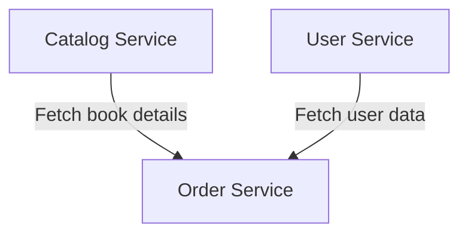

# 🛒 Bookstore Microservices Application  

## **Overview**  
This project is a microservices-based bookstore application built using Flask. It consists of three services:  

1. **Catalog Service**: Manages book details (title, author, price, etc.).  
2. **Order Service**: Handles order creation and retrieval.  
3. **User Service**: Manages user accounts and information.  
---

## **Table of Contents**  
- [Architecture](#architecture)  
- [Requirements](#requirements)  
- [Running Locally](#running-locally)  
- [Running with Docker](#running-with-docker)  
- [Testing the Services](#testing-the-services)  

---

## **Architecture**  

The application has three Flask services:  



- Each service exposes HTTP endpoints for interaction.
- Telemetry data is collected using OpenTelemetry and sent to a configured OTLP endpoint (e.g., Jaeger or Zipkin).  

---

## **Requirements**  

Make sure you have the following installed:  

- **Python 3.8+**  
- **pip** (Python package manager)  
- **Docker** and **Docker Compose** (for containerized deployment)  

---

## **Running Locally**  

Follow these steps to run the services locally on your machine:

1. Clone the repository:  
   ```bash
   git clone https://github.com/your-username/bookstore-microservices.git
   cd bookstore-microservices
   ```

2. Install dependencies for each service:  

   - **Catalog Service**:  
     ```bash
     cd catalog
     pip install -r requirements.txt
     python app.py
     ```

   - **Order Service**:  
     ```bash
     cd ../orders
     pip install -r requirements.txt
     python app.py
     ```

   - **User Service**:  
     ```bash
     cd ../users
     pip install -r requirements.txt
     python app.py
     ```

3. The services will be available at:  
   - **Catalog Service**: `http://localhost:5000`  
   - **Order Service**: `http://localhost:5001`  
   - **User Service**: `http://localhost:5002`  

---

## **Running with Docker**  

The application includes Dockerfiles for each service and a `docker-compose.yml` file for running all services together.

1. Build and start the services using Docker Compose:  
   ```bash
   docker-compose up --build
   ```

2. The services will be available at the following ports:  
   - **Catalog Service**: `http://localhost:5000`  
   - **Order Service**: `http://localhost:5001`  
   - **User Service**: `http://localhost:5002`  

3. Stop the services:  
   ```bash
   docker-compose down
   ```

---

## **Testing the Services**  

Here are sample **cURL** commands to test the endpoints:

### **1. Catalog Service**  

- **Add a new book**:  
   ```bash
   curl -X POST http://localhost:5000/books \
        -H "Content-Type: application/json" \
        -d '{"title": "Sample Book", "author": "Author Name", "price": 19.99}'
   ```

- **Get all books**:  
   ```bash
   curl -X GET http://localhost:5000/books
   ```

---

### **2. Order Service**  

- **Place a new order**:  
   ```bash
   curl -X POST http://localhost:5001/orders \
        -H "Content-Type: application/json" \
        -d '{"book_id": "12345", "quantity": 2, "total_price": 39.98}'
   ```

- **Get all orders**:  
   ```bash
   curl -X GET http://localhost:5001/orders
   ```

---

### **3. User Service**  

- **Add a new user**:  
   ```bash
   curl -X POST http://localhost:5002/users \
        -H "Content-Type: application/json" \
        -d '{"name": "Taylor", "email": "taylor@example.com"}'
   ```

- **Get all users**:  
   ```bash
   curl -X GET http://localhost:5002/users
   ```

---

## **Contributing**  

Feel free to contribute to this project by submitting issues or pull requests!  

---

## **License**  
This project is licensed under the MIT License.
